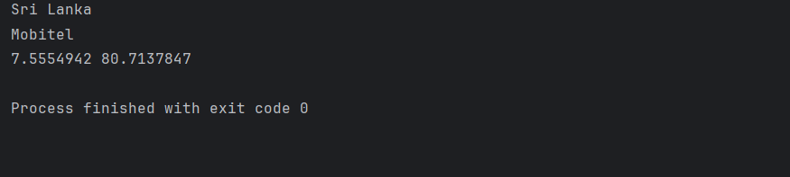
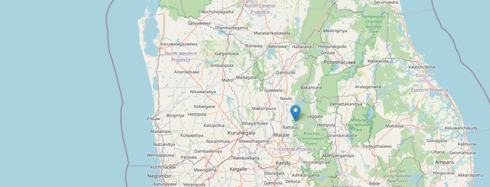

# 📍 Phone Number Location Tracker

This is a Python project that demonstrates how to track a person’s **approximate location** using their **phone number**.  
The project uses the **phonenumbers** library for parsing number details, the **OpenCage Geocoder API** for geographical coordinates, and **Folium** to generate an interactive map in HTML.

---

## 🚀 Features
- Parse and validate phone numbers.
- Identify the service provider (carrier).
- Get approximate geographical coordinates using **OpenCage API**.
- Generate an interactive map (`myLocation.html`) with the tracked location marked.

---

## 🛠️ Technologies Used
- **Python 3.x**
- **phonenumbers** (for parsing and geocoding)
- **OpenCage Geocoder API**
- **Folium** (for map rendering)

---

## 📂 Project Structure


## Project Structure
📁 PhoneNumberTracker
│── 📄 main.py         # Main script (runs the tracker)
│── 📄 myPhone.py      # Stores the phone number
│── 📄 myLocation.html # Generated output map (after running main.py)
│── 📁 .venv           # Virtual environment (dependencies)
│── 📄 README.md       # Project documentation
## ⚙️ Installation & Setup

1. Clone the repository:
   ```bash
   git clone https://github.com/SithuniNudara/Phone-Number-Tracker
   cd PhoneNumberTracker
   
2.Create a virtual environment(Optional):

    python -m venv .venv
    .venv\Scripts\activate   # On Windows
    source .venv/bin/activate # On macOS/Linux

3.Install dependencies:

    pip install phonenumbers opencage folium

4. Get an API key from OpenCage Geocoder and add it to main.py.

5. Add your phone number in myPhone.py.

6. Console will show:

    Location (country/region)

    Carrier (service provider)

    Latitude & Longitude

7. Output map will be generated as:
    
    myLocation.html

8. Open it in your browser to view the tracked location.


**Screenshot (Console Output):**


**Screenshot (Map Output):**


# Hi, I'm Sithuni! 👋


## 🚀 About Me
I'm a full stack developer...


## Badges

Add badges from somewhere like: [shields.io](https://shields.io/)

[](https://choosealicense.com/licenses/mit/)
[](https://opensource.org/licenses/)
[](http://www.gnu.org/licenses/agpl-3.0)

